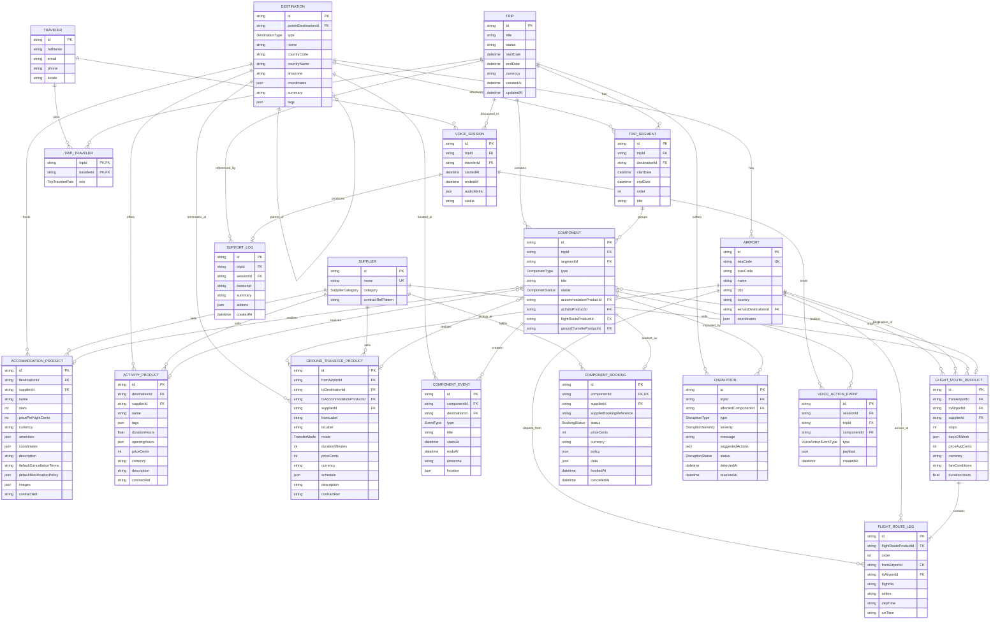

# EchoAway — Entity Relationship Model

This is the canonical data model for the EchoAway hackathon prototype.
It is split into four layers; each entity is owned by exactly one layer.

| Layer        | Purpose                                                                 | Mutability |
|--------------|-------------------------------------------------------------------------|------------|
| Catalog      | Reusable inventory seeded from `dataset/*.json` — the world's products  | Mostly read-only at runtime; reseeded on demand |
| Identity     | People                                                                  | Append-only at demo time |
| Trip         | A specific traveler's journey, derived from catalog                     | Hot path — mutated by the agent |
| Operations   | Disruptions, voice sessions, support artifacts                          | Append-mostly |

The agent reasons over the **trip layer** and **operations layer**; the **catalog layer** is the search/lookup space when building or replacing components.

---

## 1. Full ER diagram



---

## 2. Enums

```ts
// Catalog
type DestinationType   = 'country' | 'region' | 'city' | 'city_area' | 'island' | 'park'
type SupplierCategory  = 'accommodation' | 'activity' | 'transfer' | 'flight'
type TransferMode      = 'bus' | 'shuttle' | 'private_car' | 'train' | 'taxi'

// Trip
type ComponentType     = 'flight' | 'accommodation' | 'activity' | 'transfer'
type ComponentStatus   = 'planned' | 'quoted' | 'booked' | 'cancelled' | 'changed'
type BookingStatus     = 'confirmed' | 'pending_change' | 'cancelled'
type EventType         = 'departure' | 'arrival' | 'check_in' | 'check_out'
                        | 'pickup' | 'meeting_point' | 'activity_start' | 'activity_end'
type TripTravelerRole  = 'lead' | 'companion' | 'child'

// Operations
type DisruptionType        = 'flight_delay' | 'flight_cancellation' | 'schedule_change'
                            | 'overbooking' | 'closure' | 'weather'
type DisruptionSeverity    = 'info' | 'minor' | 'major' | 'critical'
type DisruptionStatus      = 'open' | 'mitigated' | 'resolved'
type VoiceActionEventType  = 'session_started' | 'assistant_listening' | 'assistant_thinking'
                            | 'trip_loaded' | 'change_suggested' | 'confirmation_required'
                            | 'change_confirmed' | 'change_rejected' | 'support_log_created'
                            | 'session_ended'
```

---

## 3. Relationship rules

### Component → Catalog Product (polymorphic-by-nullable-FK)

A `Component` has exactly one of `accommodationProductId`, `activityProductId`, `flightRouteProductId`, `groundTransferProductId` set, matching its `type`. Enforced in app code (the seed and tool layer); SQLite doesn't have native discriminated unions.

This lets a single `Component` table serve all four types without table-per-type fragmentation, while still giving the agent a referential link back to the catalog (so it can re-search alternatives or cross-check policies).

### ComponentBooking is the booked snapshot

`ComponentBooking.data` is a typed JSON document that **snapshots** the catalog product at booking time (name, price, policy text). The catalog can later mutate without breaking the booking — this is the same separation-of-concerns rule from the original design brief.

The exact JSON shape per type is spec'd in [`./component-data-shapes.md`](./component-data-shapes.md).

### Destination hierarchy

`Destination` is self-referential via `parentDestinationId`. Seed builds:

```
Spain (country)
├─ Barcelona (city)
│  └─ La Barceloneta (city_area, optional)
├─ Sitges (city)
├─ Valencia (city)
├─ Albufera Natural Park (park, child of Valencia)
└─ ... 28 destinations total
```

`Airport.servesDestinationId` is a soft link from infrastructure to a destination — used so the agent can answer "what airport serves Barcelona?".

### Disruption is the demo trigger

A `Disruption` references the impacted `Component` and contains `suggestedActions` (JSON array). The voice agent uses this as the entry point for the demo flow — see PLAN.md Phase 5.

### VoiceSession bundles the conversation

A `VoiceSession` groups events emitted during one voice interaction. It produces at most one `SupportLog` artifact when the user hangs up. Events are also queryable independently (e.g., for the live UI feed) via `tripId` or `componentId`.

---

## 4. Why this shape — at a glance

1. **Catalog is reusable.** Seed data is loaded once, queried by the agent's `searchTravelContext`-equivalent tools, never duplicated into trips.
2. **Trip layer is thin and mutable.** The 5 trip-layer entities are the only ones the voice agent writes to in normal flow.
3. **Booking is a snapshot.** Mutating catalog after booking does not change what was booked.
4. **Events are first-class.** Timeline UI, agent reasoning, and disruption attribution all key off `ComponentEvent`.
5. **Voice operations are persistent.** `VoiceSession`/`VoiceActionEvent`/`SupportLog` survive restart and can be replayed for the demo.
6. **Polymorphic link is explicit.** `Component` carries 4 nullable FKs into the catalog, validated at app level — no JSON guessing for the agent.

For the in-depth design rationale, transformation pipeline, and demo-trip composition, see:

- [`./data-model.md`](./data-model.md) — narrative + decision log
- [`./component-data-shapes.md`](./component-data-shapes.md) — JSON contracts for `ComponentBooking.data`
- [`./seed-strategy.md`](./seed-strategy.md) — how each `dataset/*.json` flows into the schema
