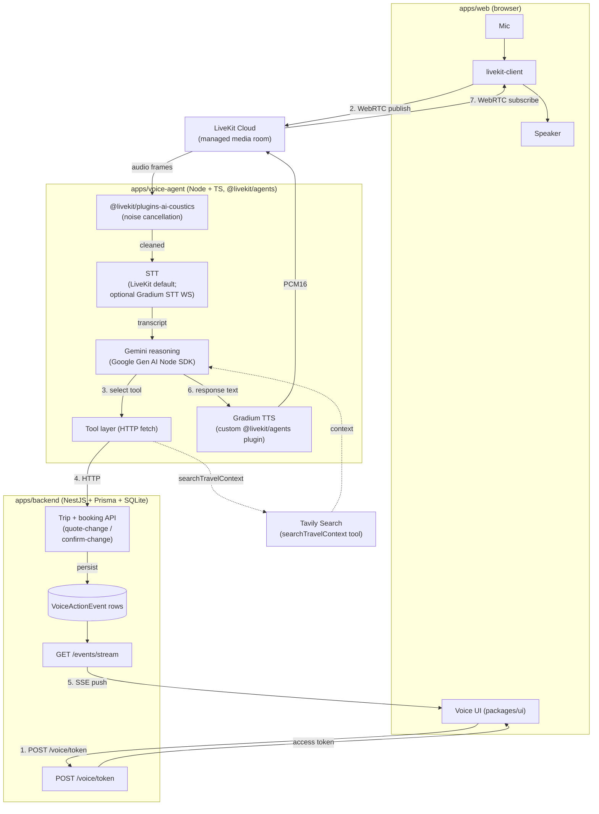
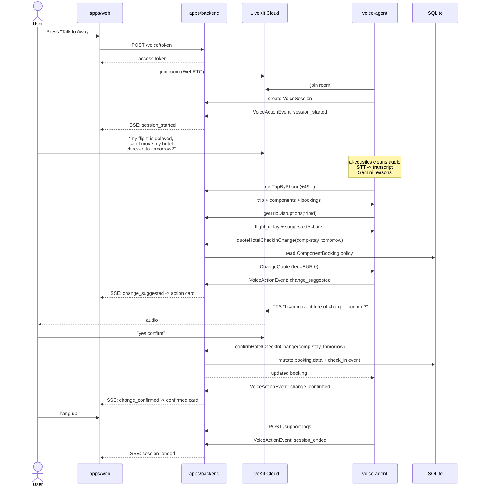

# EchoAway — Runtime flow (visual)

Visual companion to [`../PLAN.md`](../PLAN.md) §3 and the architecture
summary in [`../CLAUDE.md`](../CLAUDE.md). Two diagrams:

1. **Realtime audio + control loop** — what happens during a live voice
   conversation with the agent.
2. **Demo conversation sequence** — the seeded "move my hotel check-in"
   flow, end-to-end.

---

## 1. Realtime audio + control loop

The numbered edges are the typical request order during a single
conversational turn. The two audio paths run in parallel with the SSE
channel.

**Why two channels (audio + SSE).** LiveKit carries the realtime audio
between user and agent. SSE carries structured events
(`change_suggested`, `change_confirmed`, …) from backend to UI, so the
web app can render action cards in lock-step with what the agent is
saying. Both flows originate from the same agent loop but travel over
different transports.

---

## 2. Demo conversation sequence

The seeded **Barcelona Long Weekend** demo. The outbound flight is
pre-loaded with a `flight_delay` `Disruption`; the hotel
`ComponentBooking.policy` is overridden to allow free same-day check-in
change ([`./seed-strategy.md`](./seed-strategy.md) §3.3).

The deterministic replay script (Phase 5) drives the same backend ↔
web sequence without LiveKit or Gemini in the loop — the SSE channel
emits the same events, so the UI can't tell the difference. This is
the demo backup if voice flakes during the live pitch.

---

## See also

- [`./erm.md`](./erm.md) — entity-relationship model (the entities flowing through these paths)
- [`./data-model.md`](./data-model.md) — layer rationale (especially §5 demo trip)
- [`./component-data-shapes.md`](./component-data-shapes.md) — `VoiceActionEvent.payload` and `ChangeQuote` shapes
- [`../PLAN.md`](../PLAN.md) — §3 architecture, §5 backend API, §7 phase plan
